## Arousal as a continuously varying brain-body state

```{mermaid}
%%| fig-width: 10
%%| fig-height: 3
%%{init: {"flowchart": {"curve": "linear"}} }%%
flowchart TB
  A[Arousal<br/><span style='font-size:80%'>brain–body state</span>]

  A --- P[pupil diameter]
  A --- F[whisking]
  A --- L[locomotion]
  A --- H[heart rate]
  A --- N[neuromodulatory tone]
  A --- C[cortical state]
```

::: {.fragment .center}
*Arousal is inferred from proxies, not directly observed.*
:::

::: {.notes}
- I want to start by defining arousal broadly.

- Here, arousal is not simply wake versus sleep.
- Even during wakefulness, mice fluctuate between quieter and more activated brain-body
  states.

- Experimentally, we infer these states from proxies:
  - pupil diameter
  - whisking and facial motion
  - locomotion
  - heart rate
  - neuromodulatory tone
  - cortical state

- The important caveat is that none of these readouts is arousal itself.
- Pupil diameter is especially useful, but it is only one scalar readout of a richer
  state.

Take-home: throughout the talk, "arousal" means a latent brain-body state inferred from
several correlated proxies.
:::

## Arousal as a continuously varying brain-body state

:::: {.columns}
::: {.column width="42%"}
::: {.incremental}
- Pupil = arousal proxy
- Works in quiet wakefulness
- Eye metrics track Awake/NREM/REM
- Pupil–neural coupling is state-dependent
:::
:::
::: {.column width="58%"}
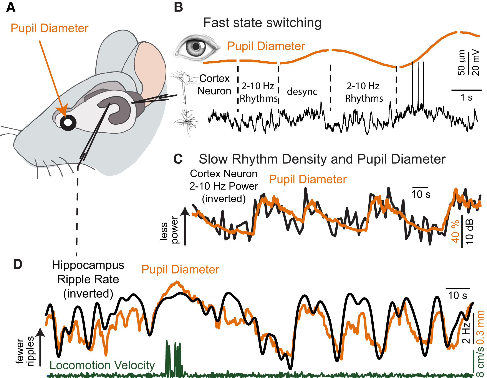
:::
::::

::: footer
McGinley *et al.*, 2015; Vinck *et al.*, 2015; Turner *et al.*, 2023
:::

::: {.notes}
- The pupil size in particular is a widely used proxy for arousal, and it tracks the
  brain-body state even in quiet wakefulness.

- McGinley et al. combined whole-cell recordings with pupil tracking and locomotion
  monitoring.

- First, the pupil size can track fast fluctuations in brain state during quiet
  wakefulness. Here you can see that in V1 layer 2/3:
  - Pupil dilation is associated with cortical desynchronization, meaning suppression of
    2–10 Hz rhythmic activity.
  - Pupil constriction is associated with stronger low-frequency rhythmic synaptic
    activity.
  - These are changes on the order of seconds.

- Pupil size also tracks slow fluctuations across sleep-wake states: 
  - In layer 5 A1 pyramidal neurons, pupil diameter anticorrelates with low-frequency
    synaptic activity.
  - In CA1, pupil diameter also anticorrelates with CA1 ripple occurence.

Take-home: pupil-linked arousal covaries with neural state even in the absence of overt
locomotion.
:::

## Arousal changes sensory processing and behavior

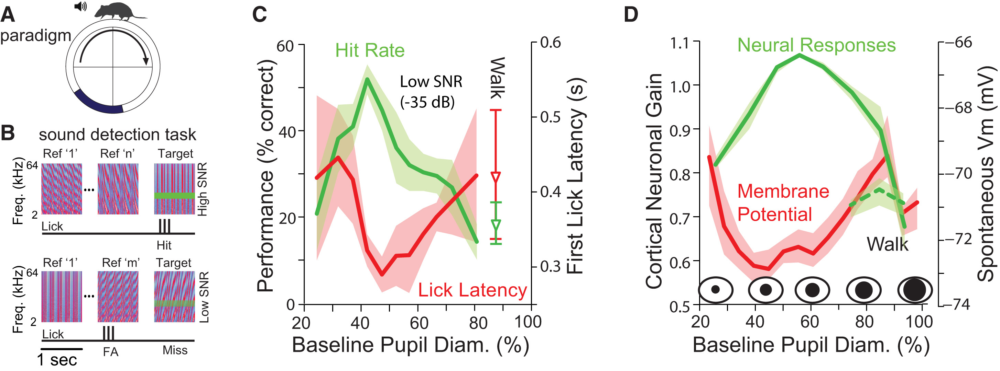

::: {.fragment .center}
*Arousal is not just a confound, it changes computation.*
:::

::: footer
McGinley *et al.*, 2015; Vinck *et al.*, 2015
:::

::: {.notes}
- So pupil-linked arousal can track brain state. But one reason we're interested in
  arousal is that these state changes matter for behavior.

- McGinley et al. trained mice on an auditory detection task while tracking pupil
  diameter and locomotion.

- During non-locomotion periods, performance depended on pupil size.
  - Hit rate peaked at intermediate pupil diameters.
  - Lick latency was shortest at intermediate pupil diameters.

- Small pupils, corresponding to low arousal, and large pupils, corresponding to high
  arousal, were both associated with poorer performance.

- Locomotion was analyzed separately.
  - It behaved more like a high-arousal regime.
  - Performance decreased and lick latency increased during locomotion.

- The neural correlate is also important.
  - Cortical gain in auditory cortex peaked at intermediate pupil diameter.
  - Locomotion was associated with reduced cortical gain.

Take-home: arousal is not just a nuisance variable. It changes sensory processing and
behavior, often nonlinearly.
:::

## Arousal can organize brain-wide dynamics

:::: {.columns}

::: {.column width="45%"}
::: {.incremental}
- Pupil = scalar readout
- But arousal may be a richer dynamical process
- Each readout is a different projection of that process
- These dynamics predict brain-wide physiology
:::
:::
::: {.column width="55%"}
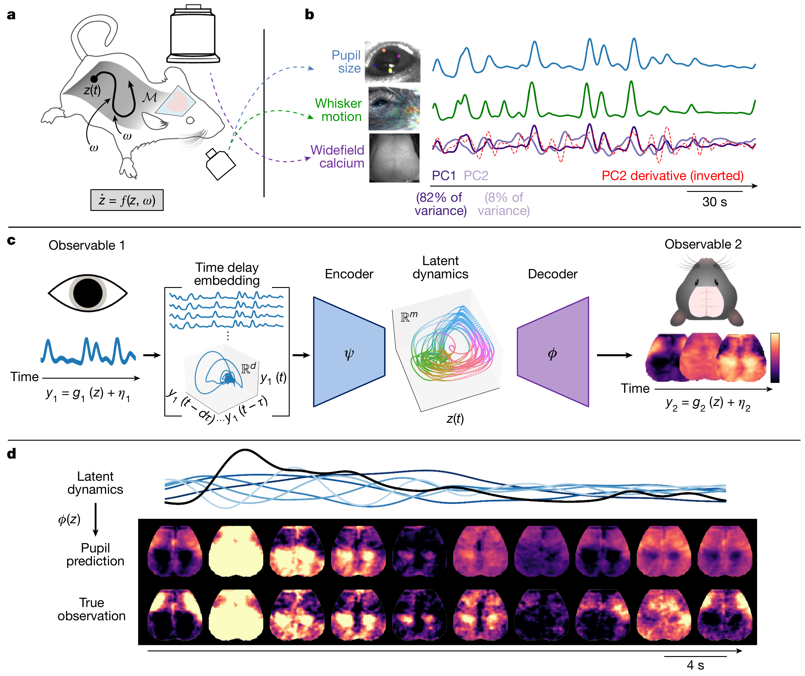
:::
::::

::: footer
Stringer *et al.*, 2019; Raut *et al.*, 2025
:::

::: {.notes}
- Now that we have a better understanding of pupil-linked arousal, we can ask how it
  relates to brain-wide dynamics.
- There is a growing body of evidence that arousal is not just a scalar readout, but rather a
  richer dynamical process that unfolds over seconds to minutes. For exemple the
  Stringer et al. 2019 paper from the lab, or this recent by Raut et al. 2025 that was
  previously presented in a journal club by Agnes.

- They recorded widefield calcium imaging together with face videography in awake mice.

- From the video, they extracted pupil diameter and whisker motion.
- From imaging, they extracted cortex-wide calcium dynamics.

- Their key interpretation is that these observables are different projections of an
  underlying arousal-related dynamical process.

- In this view, pupil diameter is not the whole state.
  - It is a scalar readout of a richer process evolving over time.
  - The recent history of pupil diameter contains information about that latent arousal
    trajectory.

- Their model uses time-delay embeddings of pupil diameter to reconstruct latent arousal
  dynamics.
- These dynamics can predict brain-wide calcium, metabolism, and hemodynamic signals.

Take-home: arousal can be thought of as a low-dimensional dynamical process that
organizes brain-wide physiology.
:::

## Arousal-linked hemodynamics are not just bulk activity

:::: {.columns}
::: {.column width="38%"}
::: {.incremental}
- fUSI = blood volume ≠ neural activity
- Arousal evokes brain-wide blood-volume changes
- Bulk firing misses key dynamics
:::
:::
::: {.column width="62%"}
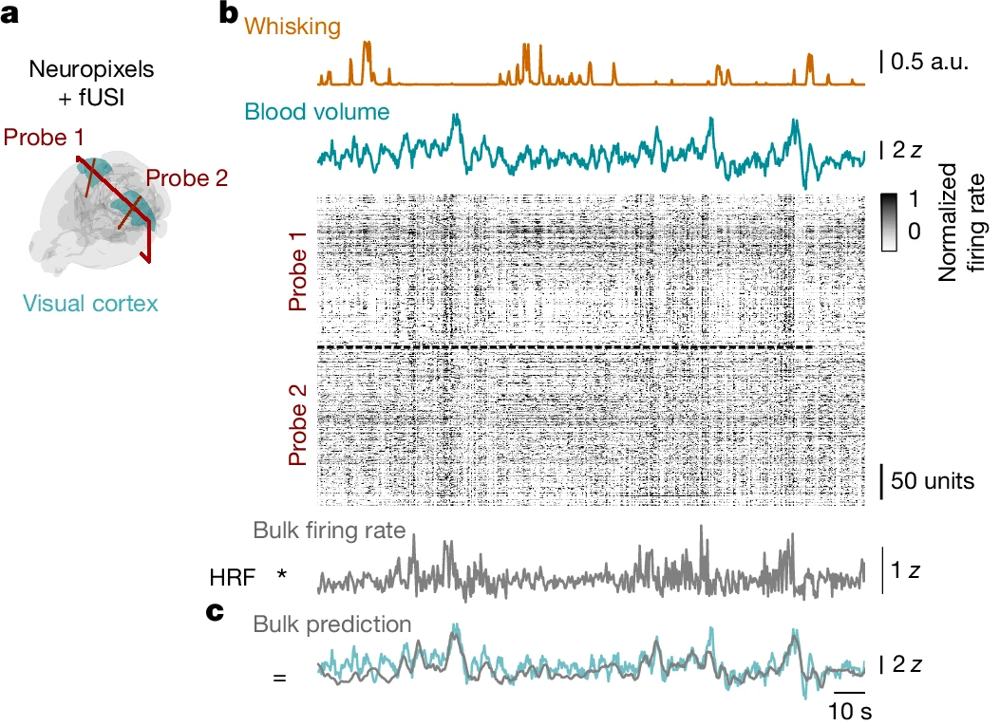{height=450}
:::
::::

::: footer
Landemard *et al.*, 2026
:::

::: {.notes}
- This slide connects the arousal story to the signal measured by fUSI.

- fUSI measures blood volume, not spikes.
- So the key question is how blood volume relates to underlying neural activity during
  arousal.

- Landemard et al. imaged blood volume with fUSI while simultaneously recording hundreds
  of neurons with Neuropixels probes.
- They focused mainly on visual cortex and hippocampus.

- Here they first try the standard approach:
  - take the average firing rate across neurons
  - fit a hemodynamic response function
  - use that filtered bulk firing rate to predict blood volume

- The fitted HRF was monophasic and peaked around 1.8 seconds after neural activity, as
  expected.

- But the bulk model did not capture the blood-volume dynamics well.
  - The prediction tended to lag.
  - It missed fast changes around whisking events.

Take-home: arousal-linked blood-volume dynamics are not well explained by bulk firing
rate plus one HRF.
:::

## Arousal-linked hemodynamics are not just bulk activity

:::: {.columns}
::: {.column width="38%"}
- fUSI = blood volume ≠ neural activity
- Arousal evokes brain-wide blood-volume changes
- Opposing arousal-linked populations predict better
:::
::: {.column width="62%"}
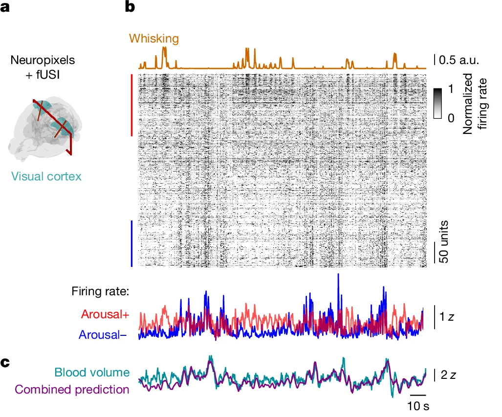{height=450}
:::
::::

::: footer
Landemard *et al.*, 2026
:::

::: {.notes}
- This is the second step of the Landemard result.

- Instead of averaging all neurons together, they sorted neurons by their correlation
  with whisking, used as an arousal marker.

- This revealed two opposing populations:
  - Arousal+ neurons increase firing during whisking.
  - Arousal− neurons decrease firing during whisking.

- They then modeled blood volume as the sum of these two populations, each with its own HRF.

- Both HRFs were positive, but they had different timing.
  - The Arousal+ HRF peaked earlier, around 1.2 seconds.
  - The Arousal− HRF peaked later, around 2.1 seconds, and was broader.

- This combined model predicted blood volume better than the bulk firing-rate model.

Take-home: fUSI blood-volume signals can reflect the balance between arousal-linked
neural populations, not just total activity.
:::

## Brain-wide activity is not necessarily arousal-specific

:::: {.columns}

::: {.column width="42%"}
::: {.incremental}
- Brain-wide recordings during visual decisions
- Action-related activity is widespread
:::
:::

::: {.column width="58%"}
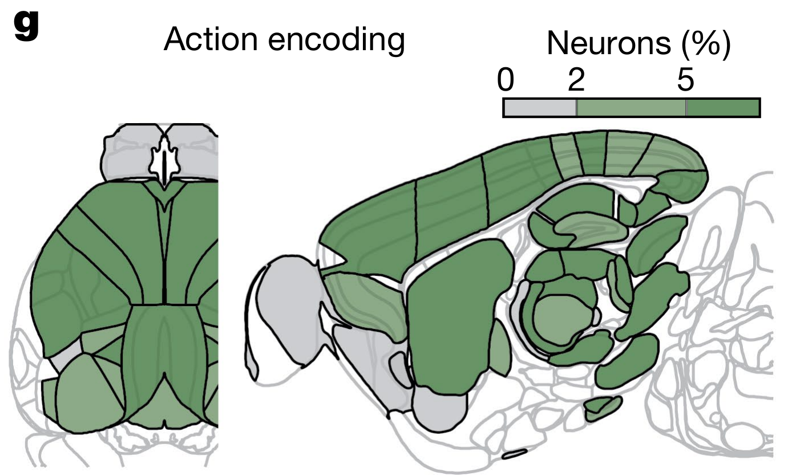{height=350}
:::

::::

::: footer
Steinmetz *et al.*, 2019
:::

::: {.notes}
- This slide adds an important caveat.

- So far, I have been building the case that arousal can organize brain-wide physiology
  and hemodynamics.
- But brain-wide activity is not automatically an arousal signal.

- Steinmetz et al. recorded from around 30,000 neurons across 42 brain regions during a
  visual decision task.

- They used a kernel model to identify which neurons carried visual, action, or
  choice-related signals.

- The crop here shows the action kernel.
- The key point is that action-related activity was distributed broadly across the
  brain.

- This means that action initiation can generate brain-wide neural activity, even when
  the activity is not specific to the chosen side or sensory stimulus.

Take-home: brain-wide activity can reflect action, not only arousal.
:::

## Brain-wide activity is not necessarily arousal-specific

:::: {.columns}

::: {.column width="42%"}
- Brain-wide recordings during visual decisions
- Action-related activity is widespread
- Engagement is also a brain-wide pre-stimulus state
:::

::: {.column width="58%"}
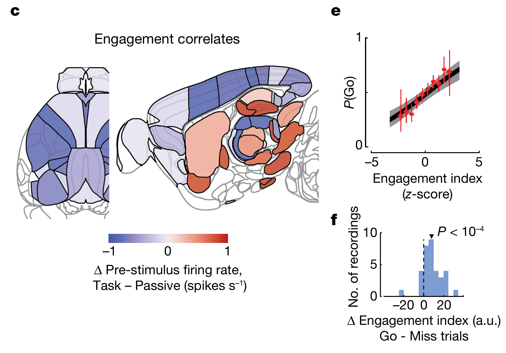{height=350}
:::

::::

::: footer
Steinmetz *et al.*, 2019
:::

::: {.notes}
- The authors defined an engagement index from pre-stimulus population activity.
- This index was computed by projecting each trial’s activity onto an axis separating task and passive contexts.

- The engagement index predicted whether the animal would make a Go response.
- It also differed between Go and Miss trials across recordings.

- Importantly, the authors report that this engagement index could not be fully
  explained by:
  - pupil diameter
  - overt movements detected by video
  - reward on the previous trial
  - inter-trial interval

- This matters for the De Paz paper because a brain-wide signal could reflect arousal,
  but it could also reflect action-readiness, engagement, or another latent state.

Take-home: brain-wide signals can reflect multiple global state variables, so
arousal-specific interpretation requires controls.
:::

## LC–NE: the canonical arousal system

:::: {.columns}

::: {.column width="42%"}
::: {.incremental}
- LC sends broad noradrenergic projections
- LC stimulation rapidly dilates the pupil
- NE axons precede rapid pupil dilations
- Natural candidate for global arousal-linked hemodynamics
:::
:::
::: {.column width="58%"}
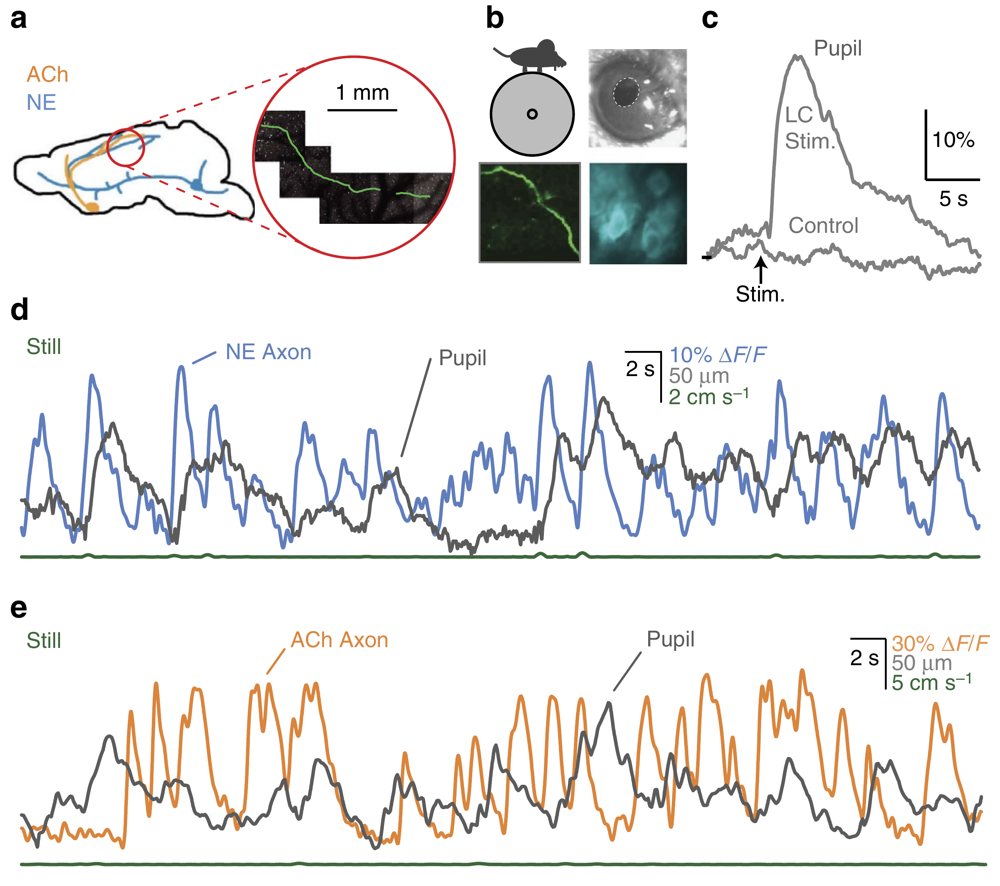
:::
::::

::: footer
Carter *et al.*, 2010; Reimer *et al.*, 2016; Poe *et al.*, 2020
:::

::: {.notes}
- Now we introduce the main mechanistic candidate: the locus coeruleus noradrenergic
  system.

- LC is a small brainstem nucleus, but it sends broad noradrenergic projections across
  the brain.
- It is classically linked to arousal, wakefulness, salience, attention, and pupil
  dilation.

- Reimer et al. imaged neuromodulatory axons in cortex while tracking pupil and
  locomotion.

- The schematic shows:
  - cholinergic projections from basal forebrain
  - noradrenergic projections from locus coeruleus

- The key result is that rapid pupil dilations during stillness are preceded by activity
  in noradrenergic axons.
- Cholinergic axons also track pupil dilations, although less tightly for these rapid
  events.

- They also show causality in one direction:
  - stimulation of LC, but not nearby tissue, produces a large rapid pupil dilation.

- So before reading the target paper, a reasonable hypothesis is that an arousal-linked
  hemodynamic wave might depend on LC–NE activity.

- But the figure also hints that pupil-linked arousal is not LC-only, because
  cholinergic activity also tracks arousal dynamics.

Take-home: LC–NE is the obvious candidate mechanism, but pupil-linked arousal already
involves multiple neuromodulatory systems.
:::

## Questions of the paper

:::: {.columns}

::: {.column width="48%"}
::: {.incremental}
1. What is the **spatiotemporal structure** of arousal-driven hemodynamics?
2. Is it shared between **spontaneous** and **sensory-driven** arousal?
3. Is this wave dependent on **LC–NE tone**?
:::
:::
::: {.column width="52%"}
```{mermaid}
%%| fig-width: 5
%%| fig-height: 5
%%{init: {"flowchart": {"curve": "linear"}} }%%
flowchart LR
  S[Spontaneous arousal<br/><span style='font-size:80%'>pupil dilation</span>] --> W[Brain-wide<br/>hemodynamic wave]
  E[Sensory-driven arousal<br/><span style='font-size:80%'>evoked pupil dilation</span>] --> W

  LC[Locus coeruleus<br/>noradrenaline] -. necessary? .-> W
```
:::
::::

::: {.notes}
- This is where we enter the actual paper.

- The authors are not only asking whether LC drives an arousal signal.
- The first question is more descriptive and more fundamental.

- Arousal shapes physiology, behavior, perception, and task performance.
- It also drives brain-wide activity, sometimes more strongly than sensory or task
  variables.

- But the spatiotemporal structure of this effect is not well characterized.
  - Is it a global signal?
  - A traveling wave?
  - A region-specific sequence?
  - Or something else?

- The second question is whether the same structure is shared between spontaneous
  arousal events and sensory-driven arousal events.

- Only after identifying the wave do they ask the mechanistic question:
  - is the wave dependent on locus coeruleus noradrenergic tone?

Take-home: the paper first defines the arousal wave, then tests whether LC–NE tone is
required for it.
:::

## Spontaneous arousal fluctuations have brain-wide fUSI correlates

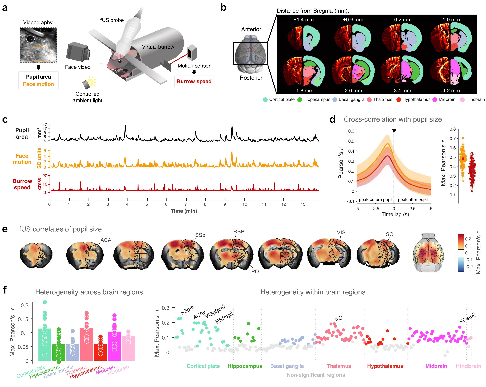

::: {.notes}
- So to investigate relationship between spontaneous arousal fluctuations and brain-wide
  hemodynamics, the authors used fUSI on head-fixed mice within a virtual burrow assay.
- The VBA is a naturalistic behavioral setup where mice rest while simultancously
  allowing them to move back and forth during higher arousal states.
- The authors tracked pupil diameter, orofacial movements, and burrow speed as
  complementary measures of arousal.
- Brain data collection occurred through a COMBO cranial window that ranged from the
  caudal end of the olfactory bulb to the rostral edge of the cerebellum

- The arousal proxies showed strong temporal correlations with each other. Since pupil
  diameter is the most commonly used arousal proxy, they focused on it as the main proxy.
- Cross-correlation analysis between pupil diameter and fUSI signals revealed a robust,
  spatially heterogeneous brain-wide pattern of positive correlations whose strength
  varied across brain voxels.
- These correlations were strongest in cortex, thalamus and midbrain but substantial
  variability existed at finer spatial scales within these structures, indicating high
  heterogeneity both across and within anatomical units.

- To disentangle the unique contributions of each behavioral proxy, the authors employed
  partial correlation analysis. While partial correlates of all three behavioral traces
  remained present in the cortex, suggesting additive effects, only the partial
  correlates of pupil size extended into the thalamus and midbrain, closely matching the
  full correlation maps.

Take-home: spontaneous arousal fluctuations are associated with broad, structured
hemodynamic correlates.
:::

## Spontaneous arousal fluctuations have brain-wide fUSI correlates

<video controls class="hemo-video">
  <source src="figures/final/hemodynamic_wave.mp4" type="video/mp4">
</video>

<br> 

::: {.fragment}
*Spontaneous arousal fluctuations correlate with fUSI signals across the
brain, but the pattern is spatially heterogeneous.*
:::

::: {.notes}
The key take-home from Figure 1 is not just that pupil correlates with fUSI.

The important point is that spontaneous arousal fluctuations have broad but
heterogeneous brain-wide hemodynamic correlates.

This motivates the next analysis: instead of only asking where pupil correlates with
fUSI, the authors ask whether arousal events have a stereotyped spatiotemporal
structure depending on whether they are spontaneous or sensory-driven.
:::

## Spontaneous and evoked arousal recruit shared "arousal regions"

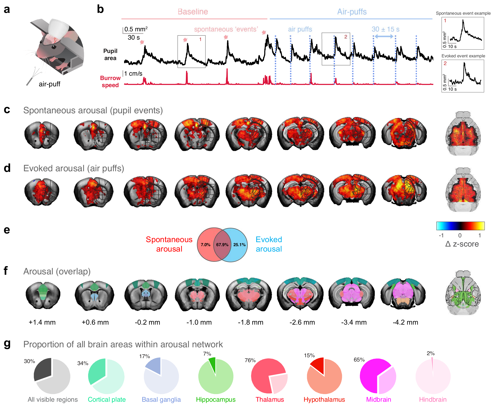

::: {.notes}
- Arousal is known to increase in response to sensory stimuli, but it is unclear whether
  spontaneous and sensory-driven arousal recruit the same brain regions.
- To address this question, the authors compared the spatial patterns of fUSI
  correlations with pupil diameter during spontaneous arousal events and during
  sensory-evoked arousal events.
- Air-puff delivery was pseudo-random and associated with minimal burrow movement and
  showed no habituation across trials. Spontaneous pupil events typically occured every
  80 seconds together with burrow motion.
- Panel b shows an example recording with both spontaneous events and air-puff-evoked
  pupil responses. The important point is that the authors can compare naturally
  occurring pupil-linked arousal events with sensory-evoked pupil dilations.

- For both spontaneous and evoked arousal conditions, the authors extracted voxel-wise
  fUSI signals time-locked to arousal events. This analysis revealed a structured,
  large-scale "wave-like" propagation of hemodynamic activity from midbrain to frontal
  cortex in both conditions.
- Fiber photometry recordings in the caudal cingulate cortex, one of the common active
  areas in both waves, showed calcium activity increases across conditions, thus
  discarding a purely hemodynamic explanation of these responses.
- Other controls where done (white noise instead of air puffs, air puffs under
  anesthesia) to rule out the possibility that the wave was driven by sensory input or
  movement.

- The authors found that a large fraction (67.9%) of brain regions significantly active
  during either spontaneous or evoked arousal overlapped across both conditions. These
  core arousal regions comprised most of the thalamus as well as large portions of the
  midbrain and cortex.

Take-home: spontaneous and sensory-driven arousal recruit overlapping fUSI-defined
arousal regions. This answers the generality question at the regional level, but not yet
at the level of temporal dynamics.
:::

## Arousal propagates from brainstem to cortex

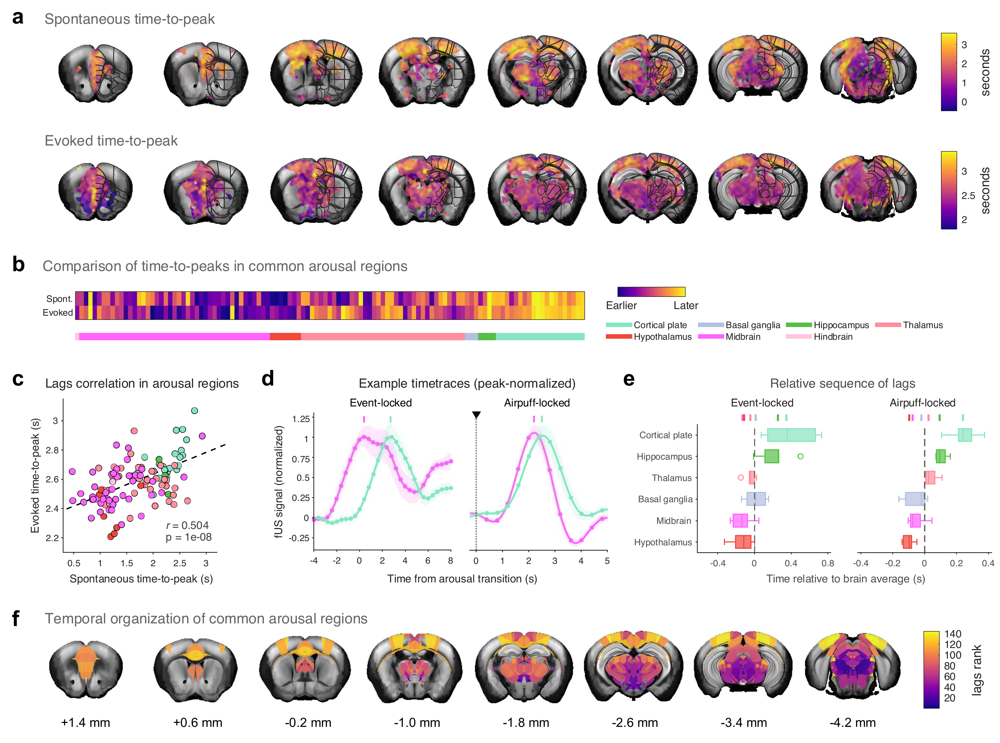

::: {.notes}
- Figure 2 showed that spontaneous and evoked arousal recruit overlapping brain regions.
  Figure 3 asks whether the temporal structure of the response is also shared.

- Panel a maps the time-to-peak of the fUSI response across coronal slices, separately
  for spontaneous pupil events and air puffs. While spontancous arousal spanned over a
  longer timeframe than evoked arousal (5.70 vs. 4.37 seconds, respectively), the
  spatial organization of the delay maps was remarkably conserved, with cortical regions
  consistently peaking later than subcortical regions in both conditions.
- The key visual result is a temporal gradient: the response peaks earlier in brainstem
  and subcortical regions, and later in cortical regions.

- To facilitate comparisons, the authors grouped the voxel-wise delays into anatomical
  regions belonging to the core arousal network. The region-wise relative delays were
  highly correlated across spontaneous and evoked conditions, confirming a common
  activation sequence that originated in the midbrain and propagated frontally and
  laterally along the cortex

- To assess whether the observed timing differences reflected neural population dynamics
  rather than region-specific hemodynamic coupling, the authors leveraged an independent
  fiber photometry dataset acquired in awake mice within the VBA. Fiber photometry
  recordings showed calcium activity increases around pupil events, with region-specific
  fiber photometry delays between calcium signal and pupil peak dilation closely
  matching the fUSI-derived times until maximum activation

Take-home: the shared arousal response is not just a set of overlapping regions. It has
a consistent spatiotemporal structure, with a brainstem-to-cortex temporal gradient, and
this sequence is shared between spontaneous and sensory-driven arousal.
:::

## PCA captures the shared arousal wave

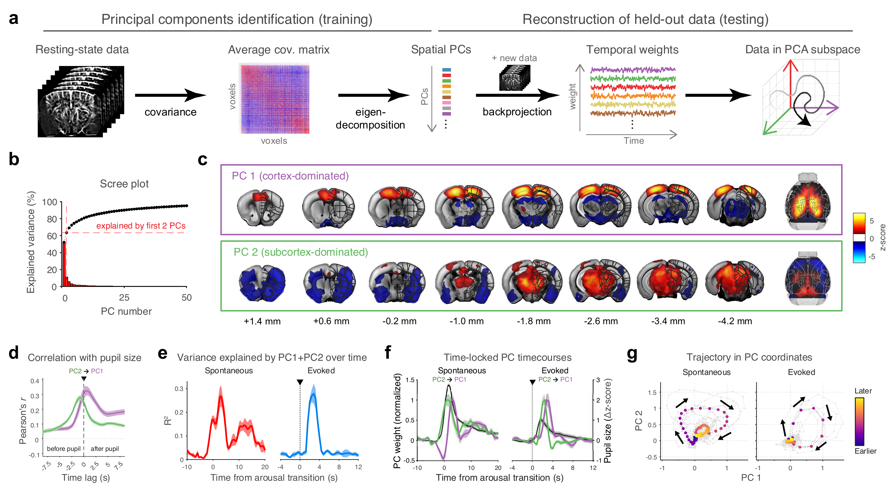

::: {.notes}
- Figure 3 showed the arousal response as a temporal gradient across regions, from
  brainstem to cortex.
- Figure 4 asks whether this shared wave can be captured in a lower-dimensional
  representation of the fUSI signal.
- Indeed, low-dimensional representations of brain activity in selected regions often
  reflect behavioral proxies of arousal (Stringer *et al.*, 2019; Raut *et al.*, 2025).

- Panel a shows the group PCA approach. They compute session-level covariance matrices
  from stimulus-free recordings, average them, and decompose this group covariance
  matrix to obtain spatial principal components. Then they project new fUSI sessions,
  including both spontaneous recordings and air-puff sessions, onto these components to
  get temporal weights.
- They regressed the global signal out before performing PCA.
- They retained the first 2 PCs, which together explained around 65% of the variance.
- PC1 was cortex dominated, while PC2 was thamalic- and midbrain-dominated. Both PCs are
  highly correlated with pupil size, and PC2 temporally preceded PC1, consistent with
  the brainstem-to-cortex gradient observed in Figure 3.

- To test generalization, they projected the held-out spontaneous *and* evoked sessions
  onto the PCs and found that these components reconstructed a comparable fraction of
  variance at the response peak in both cases (~30%), consistent with a shared latent
  structure underlying both conditions.
- The PCs also captured the timescale differences between conditions, with broader
  responses during spontaneous arousal and sharper responses  during evoked arousal.

- Panel g shows the resulting trajectory in PCA space. Spontaneous and evoked arousal
  follow similar low-dimensional trajectories.

Take-home: the arousal-linked hemodynamic wave can be summarized as a shared
low-dimensional trajectory that is both recoverable from spontaneous activity and
predictive of fUSI and pupillary repsonses across spontaneous and evoked arousal
conditions. This is consistent with the view that both spontaneous and evoked responses
reflect a common arousal state.
:::

## LC–NE manipulations change global perfusion

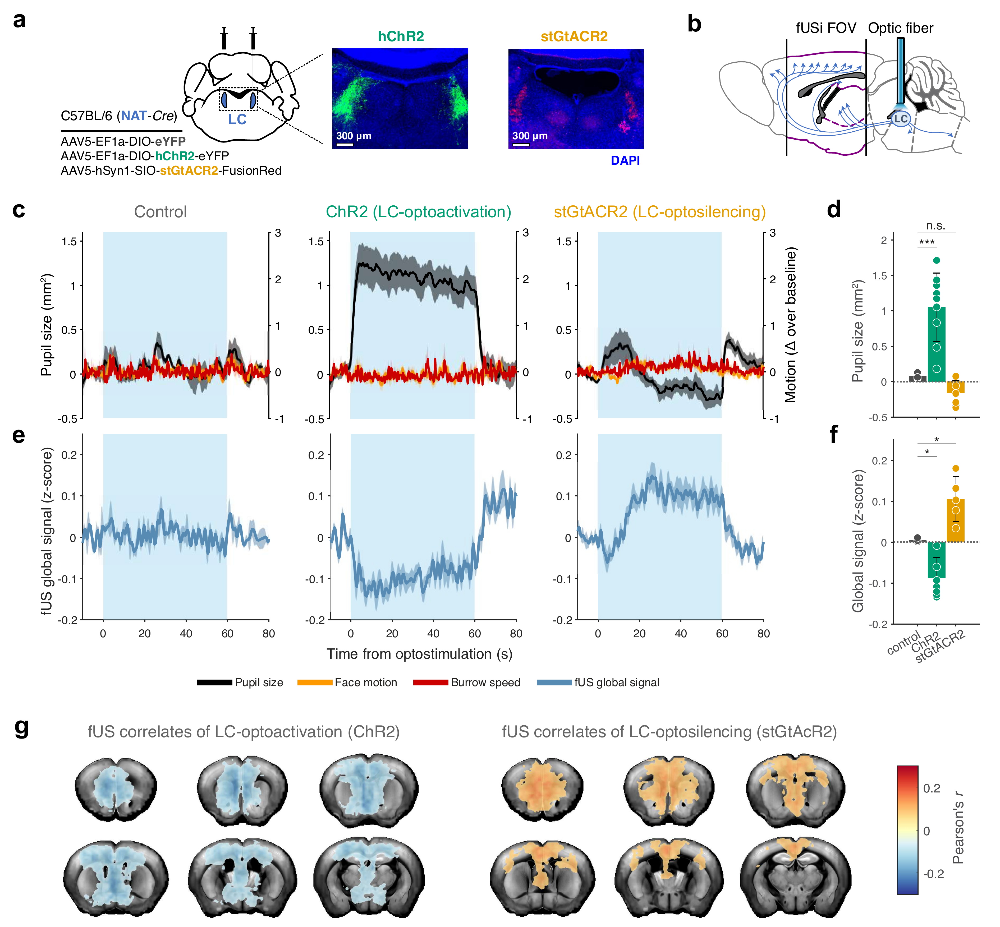

::: {.notes}
- Figure 5 starts the mechanistic part of the paper.
- Until now, the authors have established that spontaneous and evoked arousal recruit
  overlapping fUSI regions and follow a shared brainstem-to-cortex temporal gradient.

- The association between arousal state and the LC-NE system is well-established, with
  LC activity increasing in response to both spontaneous and evoked arousal.
- However, while tonic LC activations have been shown to broadly modulate brain-wide
  signals, the causal relationship between LC activity  and arousal-dependent brain-wide
  dynamics has not yet been established.
- So now they ask whether LC noradrenergic tone is necessary for these hemodynamic
  dynamics.

- For this purpose, they used optogenetics to manipulate LC activity while recording
  fUSI in the VBA. Opsins targeted to noradrenergic neurons were expressed in the LC,
  and optic fibers were implanted to allow for optogenetic stimulation or inhibition of
  LC activity. One important detail is that the fUSI field of view is shorter because of
  the optic fiber placement.
- Compared to the control, LC optogenetic activation produced immediate and significant
  pupil dilation that persisted throughout stimulation and rapidly returned to baseline
  afterwards. 

- By contrast, sustained LC optogenetic silencing caused a delayed shift towards pupil
  constriction that however did not reach statistical significance, likely due to a
  physiological floor effect. At the whole-brain level, neither manipulation elicited
  the previously identified arousal wave.
- Rather, optogenetic stimulation induced sign-consistent shifts in fUSI baseline signal
  during the entire duration of the manipulation period, namely decreases during LC
  activation and increases during LC inhibition. These fUSI signal shifts were
  widespread and spatially structured, but different from the spatiotemporal
  organization of the arousal wave.

Take home: LC manipulation is not weak or ineffective. Sustained manipulation of
noradrenergic tone clearly changes brain perfusion. This is important because the next
question is sharper: even though LC–NE tone changes perfusion, does it actually
determine the arousal-linked wave structure?
:::

## LC–NE tone is not required for the arousal wave

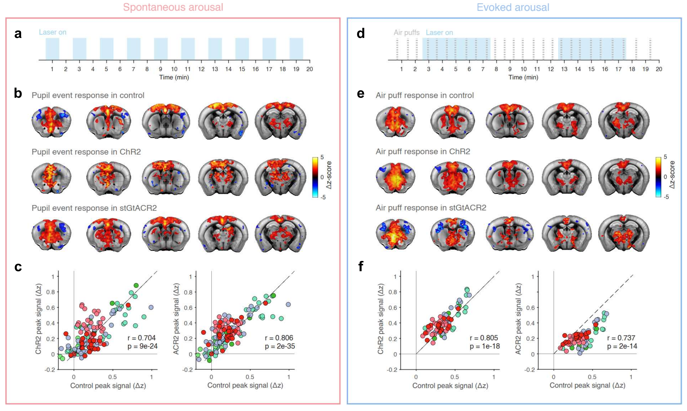

::: {.notes}
- First, the authors noticed that although reduced in magnitude, spontaneous pupil
  events continued to occur during sustained LC activation and inhibition, together with
  fUSI responses whose spatial structure paralleled those of the arousal wave in control
  animals.

- Panel b and e show normalized brain-wide fUSI response amplitude for spontaneous and
  evoked pupil events during concurrent optogenetic manipulation, across the control, LC
  activation, and LC inhibition cohorts. The regional response structure is largely
  preserved.

- Panel c and f compare regional response amplitudes between controls and either ChR2
  activation or ACR2 inhibition. If LC tone were necessary for the arousal wave, we
  might expect strong disruption or loss of correspondence with controls.

- In a complementary analysis, the authors examined the correlation maps between fUSI
  signals and face motion, another arousal proxy that is not influenced by the
  optostimulation itself, unlike pupil size. Correlation maps remained stable across
  cohorts both during and outside optostimulation periods, likewise indicating a lack of
  effect of LC manipulations over spontaneous arousal correlates.

Take home: even though LC–NE manipulations affect global perfusion, they do not abolish
or strongly impair the spatial structure of the arousal-linked fUSI response. LC
noradrenergic tone modulates brain perfusion, but the arousal wave itself persists
during both LC activation and inhibition.
:::

## Main take-home

<br>

*Arousal is not a uniform global signal.*

<br>

::: {.incremental}
- Spontaneous and evoked arousal recruit overlapping fUSI regions
- Both conditions follow a **subcortex-to-cortex temporal gradient**
- The wave is captured by a low-dimensional fUSI subspace
- LC–NE tone changes perfusion, but does **not** abolish the wave
:::

::: {.notes}
The paper does not simply show that arousal increases brain-wide fUSI signal. Instead,
it shows that arousal has a structured spatiotemporal organization.

Spontaneous pupil events and sensory-evoked arousal recruit overlapping regions, and
these responses follow a consistent temporal sequence from subcortical regions toward
cortex.

The PCA analysis shows that this wave is not only visible in event averages. It is also
embedded in ongoing resting-state fUSI activity as a low-dimensional structure.

Finally, LC manipulations strongly affect vascular signal amplitude, so they are not
ineffective. But they do not abolish the arousal-linked wave.

So the take-home is: arousal evokes a stereotyped brain-wide hemodynamic wave, but this
wave is not simply tonic LC–NE tone.
:::

## Interpretation

<br>

:::: {.columns}
::: {.column width="50%"}
#### What the wave may reflect
::: {.incremental}
- a generalized arousal state
- bottom-up subcortical → cortical recruitment
- shared latent dynamics across spontaneous and sensory-driven arousal
:::
:::
::: {.column width="50%"}
#### What LC–NE may do
::: {.incremental}
- modulates vascular/perfusion baseline
- contributes to arousal physiology
- not sufficient to reproduce the full wave
:::
:::
::::

::: {.fragment}
*LC–NE modulates the system, but may not generate the arousal wave.*
:::

::: {.notes}
This is how I would interpret the paper.

The authors propose that spontaneous and evoked arousal share a common latent structure.
This fits with the idea of generalized arousal: different triggers can bring the animal
into a similar brain-body state.

The subcortex-to-cortex sequence suggests that arousal is not just a synchronous global
gain change. It unfolds over time.

The LC result is subtle. LC is still relevant to arousal. The optogenetic manipulation
changed pupil and global perfusion, so noradrenaline clearly affects brain and body
state.

But sustained LC activation or inhibition did not reproduce the wave, and did not
prevent the wave during spontaneous or evoked arousal.

So a careful conclusion is: tonic LC–NE tone is not the primary driver of this fUSI
arousal wave. Other systems, especially acetylcholine, or interactions among multiple
neuromodulators, may be more important.
:::

## Caveats

::: {.incremental}
- **fUSI is hemodynamic**: blood volume is an indirect proxy for neural activity.
- **Movement is intertwined with arousal**: controlled, but residual motor contributions
  cannot be excluded.
- **LC manipulation was tonic**: phasic LC activity or projection-specific LC effects
  may still matter.
- **Optogenetics may affect neurovascular coupling**: especially because noradrenaline
  can act on vascular tone.
:::

::: {.notes}
This is the slide for journal club discussion.

First, fUSI measures blood volume, not neural activity directly. The authors support a
neural interpretation using prior fUSI literature and fiber photometry controls, but the
signal remains hemodynamic.

Second, movement and arousal are tightly coupled. The authors use mild air puffs,
partial correlations, light-driven pupil controls, and anesthesia controls, but residual
motor contributions cannot be completely ruled out.

Third, the LC manipulation is sustained and tonic. The result argues against tonic
noradrenergic tone as the primary driver, but it does not rule out phasic LC
contributions, projection-specific LC effects, or incomplete inhibition.

Fourth, because noradrenaline affects vascular tone, LC optogenetic manipulation might
alter neurovascular coupling itself.

Finally, the wave’s causal generator is still open. The authors point toward other
neuromodulatory mechanisms, especially acetylcholine, but the circuit mechanism remains
a natural next question.
:::

## Conclusion

<br><br><br>

::: {.center}
*Arousal engages a heterogenous, brain-wide hemodynamic wave independent of
noradrenergic tone.*
:::

::: {.notes}
This is the final one-sentence conclusion.

Arousal is not just a global scalar or a confound to regress out. In this paper, it
appears as a reproducible brain-wide dynamical motif.

The open question is what circuit mechanism generates this motif if tonic LC
noradrenergic tone is not sufficient or necessary.
:::

## Supplementary figure S1

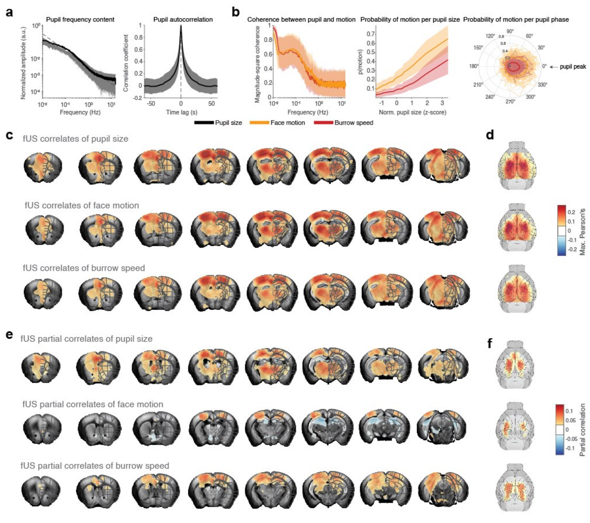

## Supplementary figure S2

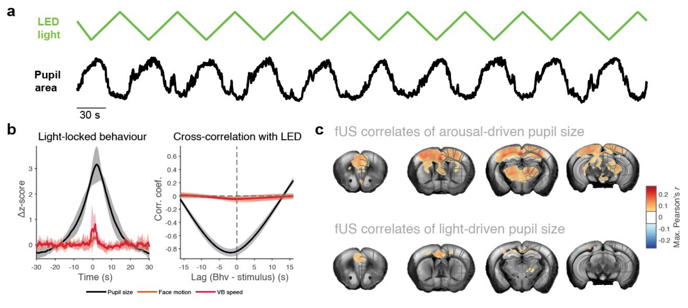

## Supplementary figure S3

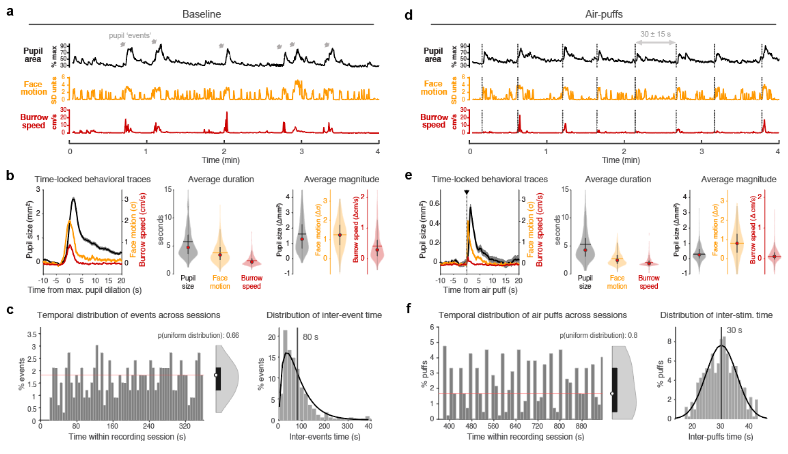

## Supplementary figure S4

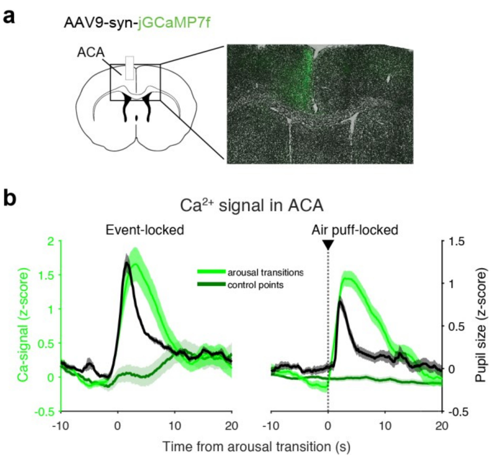

## Supplementary figure S5

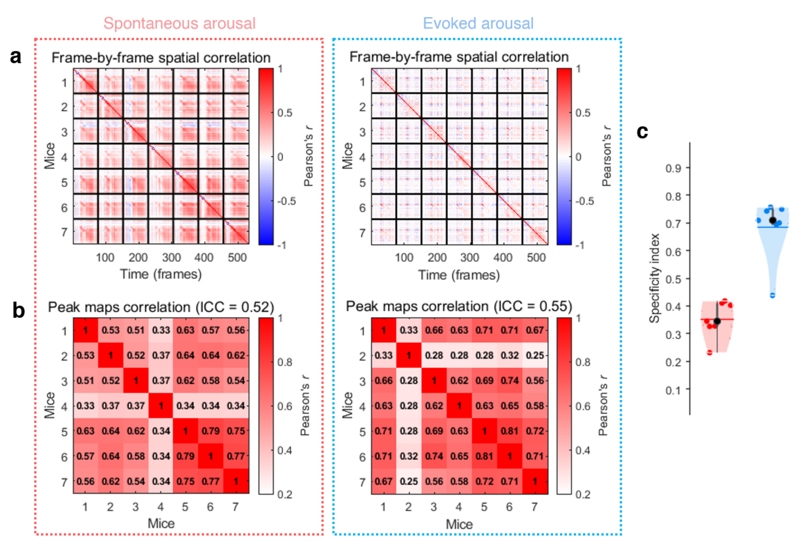

## Supplementary figure S6

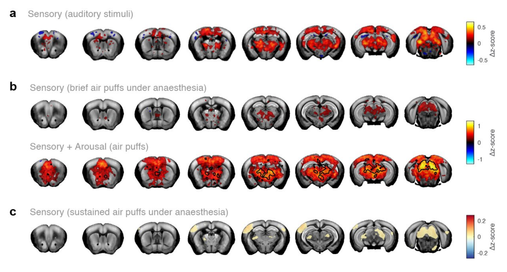

## Supplementary figure S7

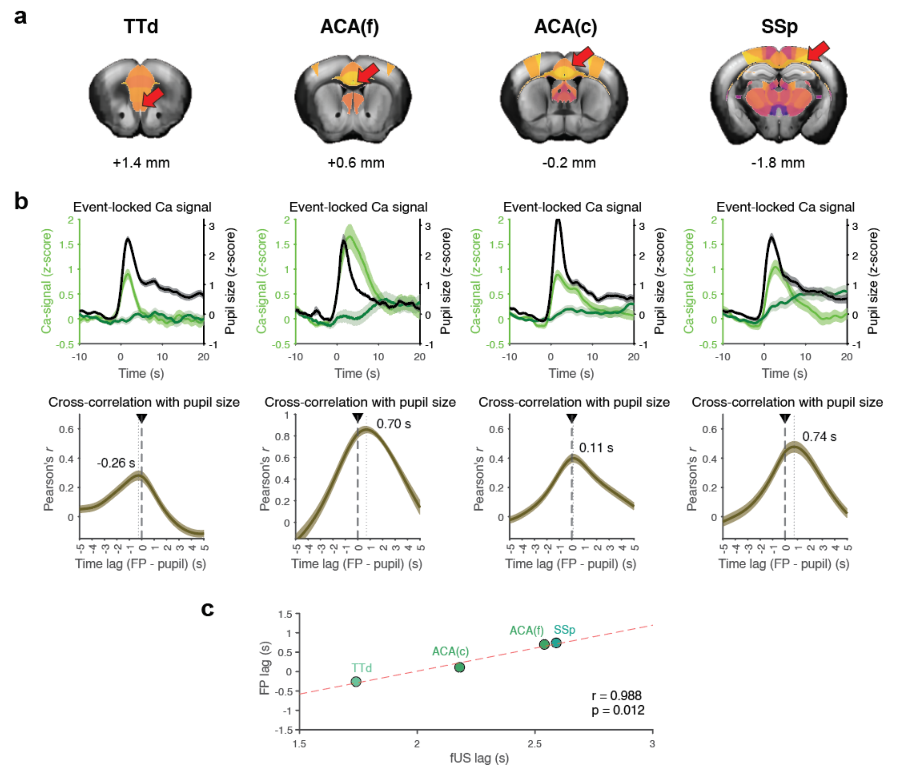

## Supplementary figure S8

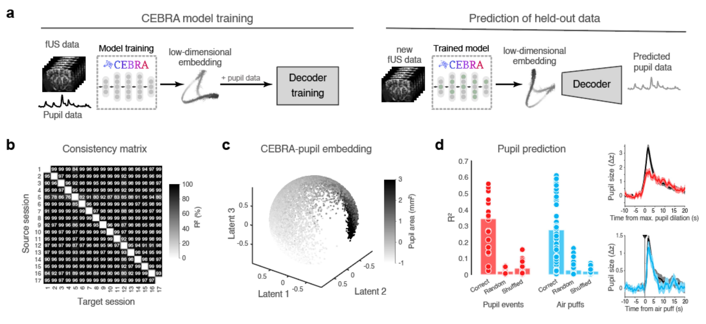

## Supplementary figure S9

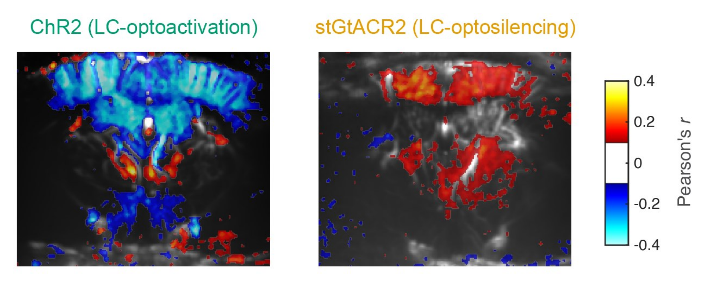

## Supplementary figure S10

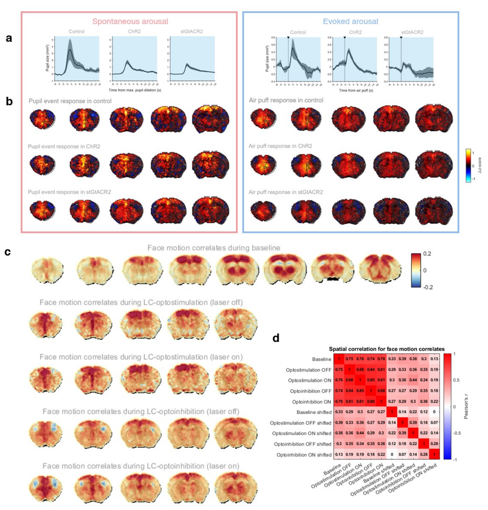

## Supplementary video 1 {.video-slide}

<video controls class="supp-video">
  <source src="media-2/SuppMovie1_spontaneous.mp4" type="video/mp4">
</video>

## Supplementary video 2 {.video-slide}

<video controls class="supp-video">
  <source src="media-2/SuppMovie2_evokedAwake.mp4" type="video/mp4">
</video>

## Supplementary video 3 {.video-slide}

<video controls class="supp-video">
  <source src="media-2/SuppMovie3_evokedFMM.mp4" type="video/mp4">
</video>
